<h1 align='center'>
    Projetos Mobile - Checkpoint 03
</h1>

<p align="center"> 
  Este repositório é a coletânea dos projetos praticados em cada aula da matéria de Mobile do 3° Ano de Engenharia de Software FIAP, com a utilização de tecnologias como React Native e Expo.
</p>

<p align="center">
  <a href="#nivelamento-javascript">Nivelamento JavaScript</a> |
  <a href="#meu-perfil">Meu Perfil</a> |
  <a href="#meu-app">Meu App</a> |
  <a href="#app-router">App Router</a> |
  <a href="#lista-de-tarefas">Lista de Tarefas</a> |
  <a href="#mini-loja">Mini Loja</a> |
  <a href="#mini-login">Mini Login</a> |
  <a href="#cadastro-app">Cadastro App</a> |
  <a href="#cinelog">Cinelog</a> |
</p>

## Autor - 3ESPG
| Nome | RM |
| :--- | :--- |
| Vinicius Fernandes Tavares Bittencourt | RM558909 |

## Como Utilizar
Para executar qualquer um dos projetos dentro do repositório é preciso apenas:
```bash
# Entrar na pasta
cd pasta-desejada

# Instalar pacote node
npm install

# Executar o projeto
npx expo start
```

## Nivelamento Javascript
Aqui se deu o início da matéria com uma rápida revisão de funções fundamentais para o trabalho do restante do ano com JavaScript.

## Meu Perfil
Primeiro contato com os componentes do React Native, criando um perfil sobre a gente e compartilhando links para contato.

| Imagem 1 |
| :---: |
| 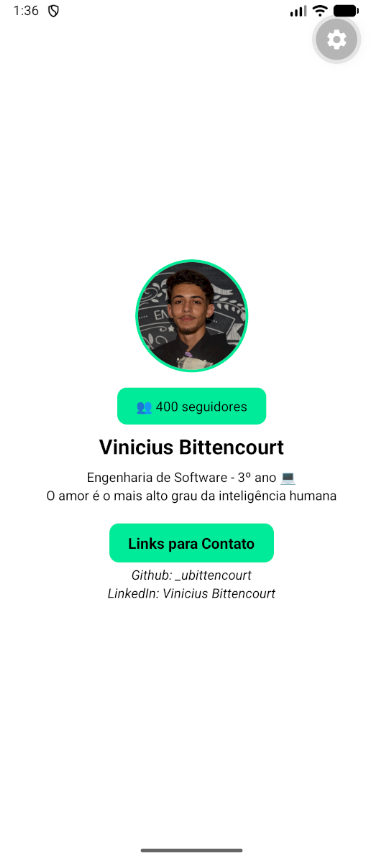 |

## Meu App
Trabalhando com estados e hooks dentro do projeto, exemplo feito foi um app de hidratação que faz a contagem de copos d'água bebidos, mudando o estilo caso atinja a meta.

| Imagem 1 | Imagem 2 |
| :---: | :---: |
| 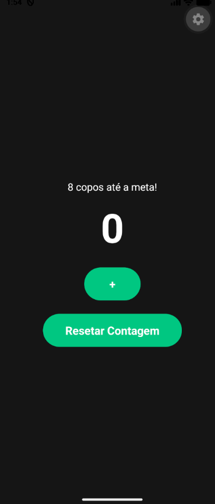 | 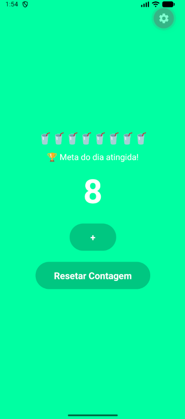 |

## App Router
Projeto com navegação entre telas usando o Expo Router, exemplo criado foram telas de apresentação de perfil de usuário.

| Imagem 1 | Imagem 2 |
| :---: | :---: |
| 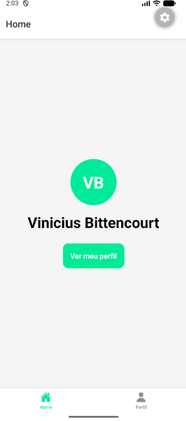 | 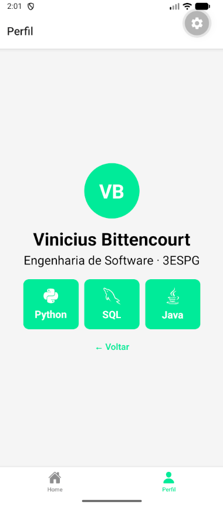 |

## Lista de Tarefas
Usando AsyncStorage para persistência dos dados, fazendo com que o app "lembre" das informações mesmo após fechar. Exemplo praticado foi uma lista de tarefas, totalmente funcional.

| Imagem 1 |
| :---: |
| 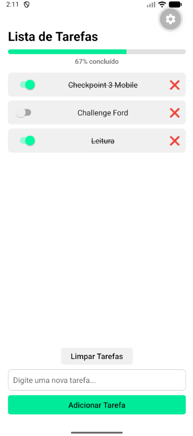 |

## Mini Loja
Trabalhando com ContextAPI para ter acesso a mesma informação dentro de qualquer tela, exemplo criado com mock de dados para testar os diversos cenários possíveis dentro de um app de loja.

| Imagem 1 | Imagem 2 |
| :---: | :---: |
| 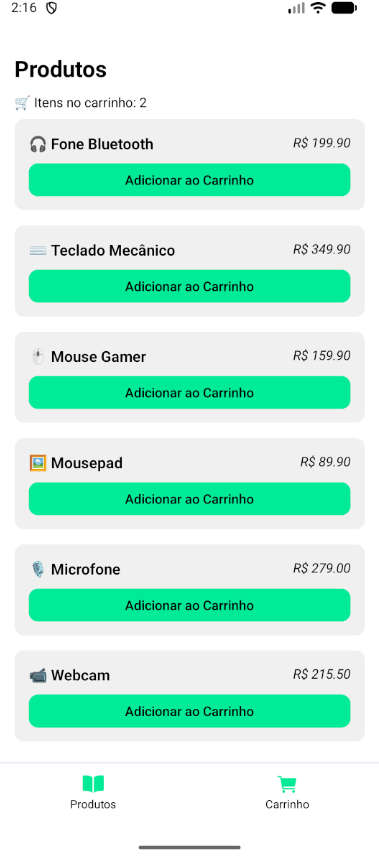 | 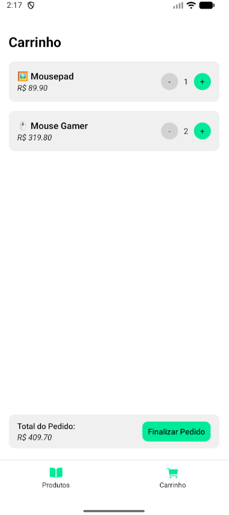 |

## Mini Login
Criando formulários com validações básica de dados, e UX que deixe um feedback visual ao usuário.

| Imagem 1 | Imagem 2 | Imagem 3 |
| :---: | :---: | :---: |
| 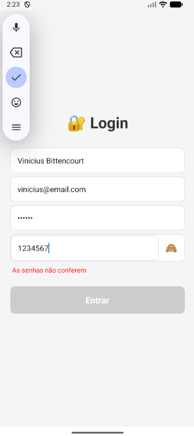 | 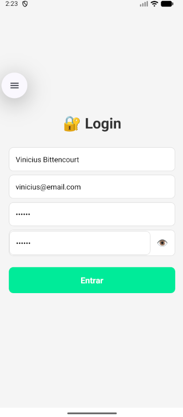 | 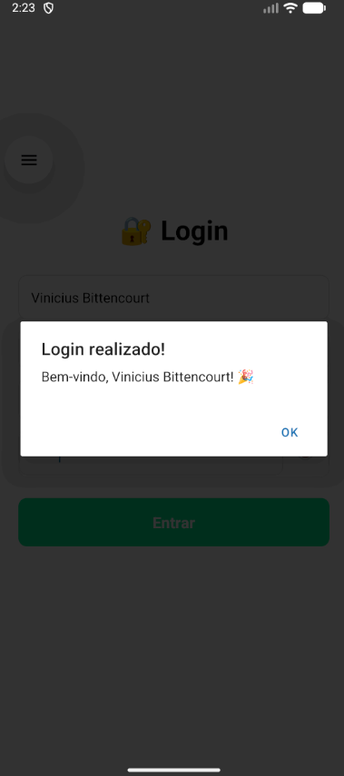 |

## Cadastro App
Continuação do trabalho com formulários, mas agora, trabalhanco com mascáras dentro dos campos (com regex), e useRef para navegar entre os inputs, ainda com feedback visual em tempo real.

| Imagem 1 | Imagem 2 | Imagem 3 |
| :---: | :---: | :---: |
| 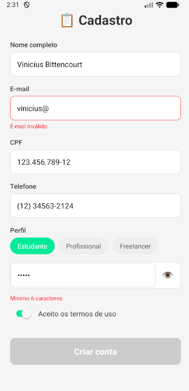 | 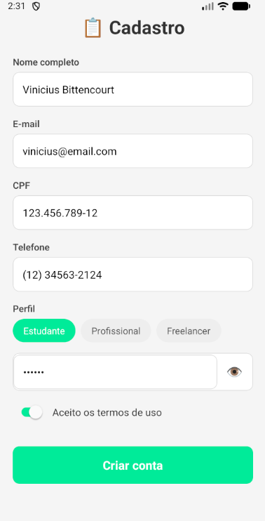 | 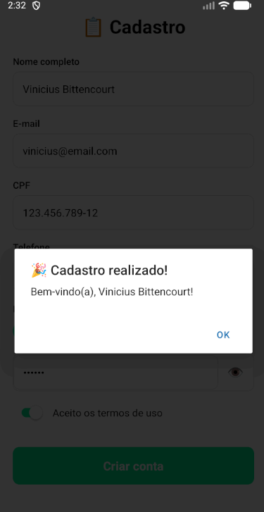 |

## Cinelog
Criação de um app completo, desde o cadastro e login, trabalhando com formulários, até a persistência dos dados e informações do app, com AsyncStorage e dados reais do usuário. No exemplo foi criado um letterboxd simplificado, com adição e remoção de filmes/séries e nota dele.

| Imagem 1 | Imagem 2 | Imagem 3 | Imagem 4 |
| :---: | :---: | :---: | :---: |
| 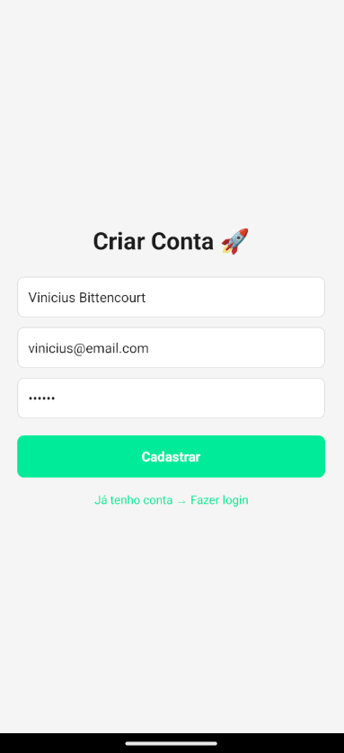 | 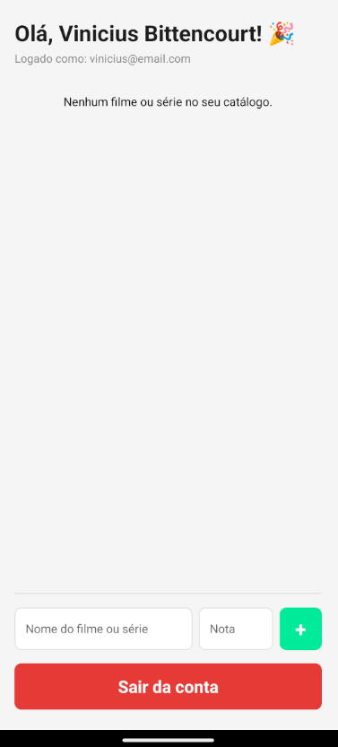 | 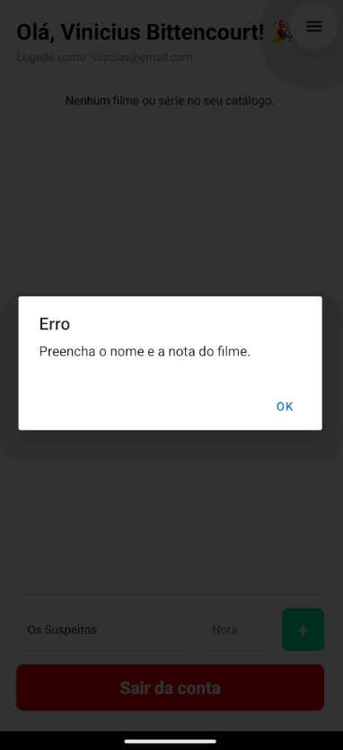 | 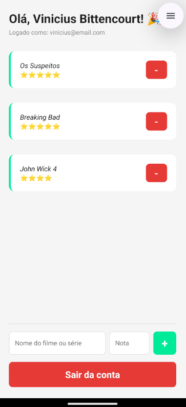 |